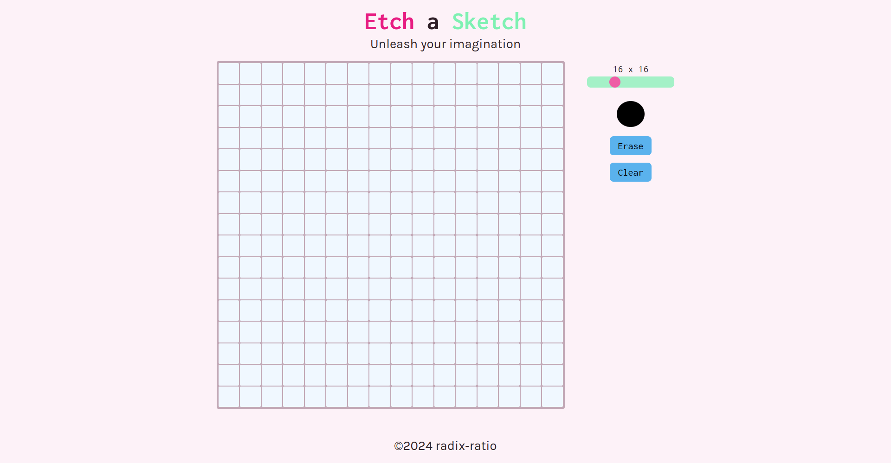

# Etch a Sketch

A simple Etch a Sketch project built with HTML, CSS, and JavaScript, created as part of The Odin Project's Foundations curriculum.

## Description

This project is a basic implementation of the classic Etch a Sketch game. The user can draw on the screen, selecting different colors.

## Features

* Simple and intuitive interface
* Responsive design for a smooth user experience
* Basic styling with a modern aesthetic

## Demo

[**Live Demo**](link to your project) | [**Project Specs**](https://www.theodinproject.com/lessons/foundations-etch-a-sketch)

## Screenshots

## Getting Started

1. Clone the repository to your local machine.
2. Open the `index.html` file in a web browser to run the application.

## License

This project is licensed under the MIT License. See [`LICENSE`](https://choosealicense.com/licenses/mit/) for details.

## Acknowledgments

- The Odin Project for providing the curriculum and resources
- Flaticon for providing the icon images

## Authors

- [@radix-ratio](https://www.github.com/radix-ratio)